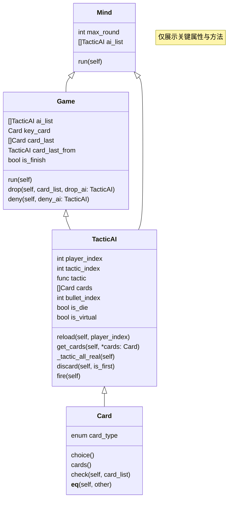

# LiarsBarStrategySimulation
## 1. 文件说明
### game.py
>该文件中定义了所有关键类来控制模拟程序的逻辑：
> - Mind类：程序模拟控制类，决定局数、策略AI的调度逻辑
> - Card类：卡牌类，模拟游戏中的A,K,Q,J(大小王)的交互逻辑
> - TacticAI类：策略AI类，用户控制策略AI的通用行为，如：开枪、出牌、接受卡牌等通用逻辑
> - Game类：游戏类，该类模拟单局游戏中的各种过程，直到决出一二三四名，并提供统计数据
> ### 逻辑关系如下

---
### tactics.py
>该文件中实现了独立策略：
> - All_Tactic变量：当你实现了自己的独立策略后，请将策略名加入到该列表中
> - 策略函数：该函数包含3个关键参数：
> -     1. ai：正在使用该策略的TacticAI实例
> -     2. game：正在进行的游戏对局Game实例
> -     3. is_first：是否为首发出牌，由于首发出牌时无法质疑，故可实现单独逻辑
## 2. 运行说明
> 1. config.py中有两个全局变量：
> -     1. TEST_ONE_TIME：该值为True时仅测试到第一次打牌结束（有人开枪或者只剩一人未出完牌），如果想要模拟多局游戏，请设置为False
> -     2. IS_TEST：如果不想把模拟成功数据保存下载，请设置为False，如果想要保存模拟数据，请确保目录下有data文件夹，并设置为True
> - 直接运行game.py文件即可进行模拟
